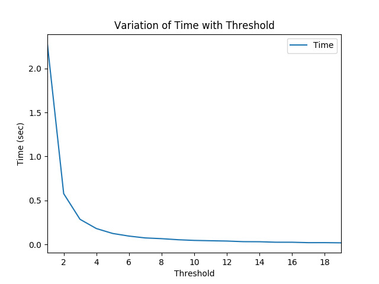
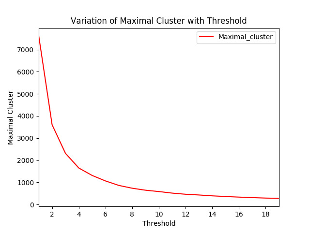
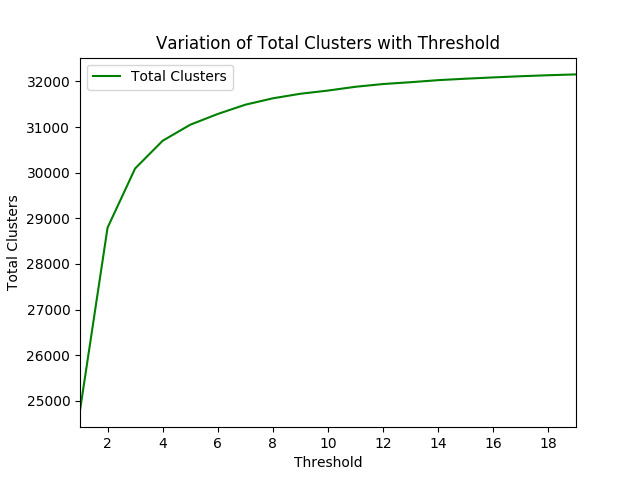
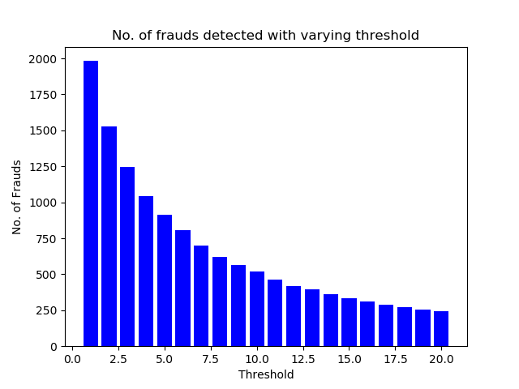

# Introduction

In this we try to bring out the companies that have participated in fradulent transactions and to find that out we have focused on the concept of circular trading as explained in the initial report. So the problem finally boils down to finding loops/cycles in the graph of transactions. As the data we used comprises of 708466 transactions and 32449 nodes, it wouldn't be possible to find all the nodes companies involved in cycles with the avaliable computational resourses. So we have developed an algorithm, which takes into consideration the loss of data while compression of the graph as well as multiple optimal compressions which fit in the RAM, to detect these potential fraudulent companies.

## Clustering

Detecting cycles on such a massive transaction data is highly time taking so we first try to group the tractions using two different clustering algorithms.
* Spectral Clustering
* SNN

### Spectral Clustering

We first started off using spectral clustering but then found out that the computation of the eigenvalues of the lapacian was not possible for such a lrage matrix. For a baseline, eigenvalue calculation for 5000 x 5000 matrix takes around an hour. So, for 32499x32499 it should take days as the worst case complexity is $O(n^3)$.
 

We even tried google collab and tensorflow for calculation of eigenvalues and even google couldn't handle the load and shifted the server to a higher RAM one. But even it failed to run on it's GPUs.
 

We left the GPU code running on our laptop for a couple of days leaving the laptop untouched and we still couldn't find the eigenvalues.

### SNN

Shared Nearest Neighbor (SNN) is a solution to clustering high-dimensional data with the ability to find clusters of varying density. SNN assigns objects to a cluster, which share a large number of their nearest neighbors. We try to group the nodes based on a certain threshold and then then used the DSU algorithm to assign clusters.
 

We introduced DSU to reduce the complexity to $O(log(V))$ because normal merge would take $O(V)$ for one edge and this is again computationally inefficient.
 

## Cycle Detection 

The important thing to note is that we need nodes involved in a cycle and not the actual cycle. Computing all simple cycles is NP-complete as there can be exponentially many cycles in a graph. 
 

One more thing to note is that adjacency matrix gives us all paths of length 1. If we multiply this matrix by itself, we get a matrix whose entries contain all paths of length 2. So if we have a non-zero entry in the diagonal, it means that there is a cycle of length 2. Similary, we keep multiply the adjacency matrix with itself multiple times, say 20 or 30 and check diagonal entries each time. If we get a non-zero value, the company was involved in a fraud.

## Statistics

### Execution time vs threshold:

 

### Maximal cluster size vs threshold:

### Number of clusters vs threshold:

 
 

This behavior is expected. As we increase the threshold, more and more information about the original graph is lost and as a result it takes lesser time to cluster and more number of clusters are obtained. The maximal cluster size also redcues as the number of nodes in a cluster decreases.  

## Final result

We plotted a bar chart showing the number of frauds detected at a particular threshold. Since the frauds may repeat across thresholds, we took the union of all the thresholds and found 1982 frauds. The plot is shown below.

